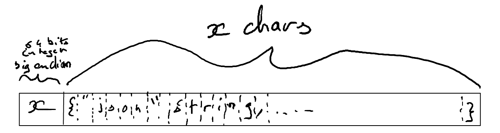
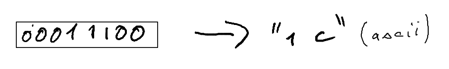

# Documentation

## Exécution

Une fois `scrabblos` installé (voir la section plus bas ou le fichier
INSTALL.md), vous pouvez lancez le serveur avec la commande:

`scrabblos-server`

Pour voir la liste des options, vous pouvez utiliser l'option:
`scrabblos-server --help`

### Proxy
Vous disposez également d'un proxy permettant d'afficher tous les
messages échanges entre le client et le serveur:

`scrabblos-proxy`

Pour utiliser le proxy, le serveur *doit impérativement* écouter sur
le port `12346`:

`scrabblos-server -port 12346`, le proxy se connectera au serveur en
utilisant le port `12346` et écoutera les messages du client sur le
port `12345`. À l'heure actuelle, le proxy ne supporte qu'un seul
client.

## Liste des messages et leur encodage

L'encodage des messages est relativement simple et extrêmement
sous-optimal. Le but est de rendre les messages facile à analyser.

Le serveur est conçu pour utiliser une connexion continue avec le
client, si la connexion TCP est coupée, les messages en attente ne
sont pas renvoyés, ils sont perdus.

L'auteur n'aura pas à réitérer le message d'enregistrement.

### Messages à destination du serveur

#### Enregistrement d'un nouvel auteur

```javascript
  { "register" : public_key }
```

Un auteur enregistré sera attendu avant de passer au tour suivant. Le
serveur répond à ce message par un sac de lettres.

La `public_key` aura été préalablement générée à l'aide du système de
signature `ed25519`. Vous pourrez, pour cela utiliser une fonction de
génération de clefs publiques et privées d'une bibliothèque adaptée à
votre language, comme par exemple la bibliothèque `Hacl` pour OCaml.

La vérification de la signature des messages peut être débrayée dans
le serveur en passant l'option `-no-check-sigs`
#### Écoute continue des messages

A l'aide des deux messages suivants, un client pourra se mettre dans
un mode d'écoute continue pour éviter d'avoir à demander régulièrement
au serveur son état.

```javascript
  { "listen" : null }
```

Après qu'un client aura envoyé ce message au serveur, ce dernier lui
retransmettra directement toutes les nouvelles lettres et les nouveaux
mots injectés ainsi que les opérations brutes (raw ops).  Le client
peut arrêter le flux de messages en envoyant :

```javascript
  { "stop_listen" : null }
```

#### Bassins de lettre

Pour obtenir l'ensemble des lettres injectées depuis le début de la
partie, on enverra le message :

```javascript
  { "get_full_letterpool": null}
```

Pour obtenir seulement les lettres injectées depuis une époque
précédente, on pourra utiliser

```javascript
  { "get_letterpool_since" : period }
```

#### Bassins de mots

De même que pour les lettres, on pourra obtenir les mots injectés par
le message :

```javascript
  { "get_full_wordpool": null}
```

et les obtenir de manière incrémentale grâce à :

```javascript
  { "get_wordpool_since" : period}
```

#### Injection de lettres et de mots

Une lettre pourra être injectée par un auteur via un message

```javascript
  { "inject_letter": letter }
```

et un mot sera injecté par un politicien par le message

```javascript
  { "inject_word" : word }
```

#### Opération brute

Enfin si vos politiciens ou vos auteurs souhaitent s'échanger des
messages non-prévus dans le serveur sans implanter une couche paire à
paires, ils peuvent envoyer une opération brute, à vous de voir ce que
vous faites du buffer.

```javascript
  { "inject_raw_op" : buf }
```

### Messages envoyés par le serveur

#### Sac de lettres

Après qu'un client s'est enregistré, le serveur lui envoie un sac de
lettre qu'il a le droit d'utiliser.

```javascript
  { "letters_bag" : [ letter... ] }
```

#### Tour suivant

À tout moment, le serveur peut annoncer qu'il passe au tour suivant en
envoyant un message :

```javascript
  { "next_turn" : integer }
```

Ce message pourra donc être reçu à n'importe quel moment, y compris
lorsque le client attend la réponse à un autre message.


#### Bassin de lettres et de mots

En réponse aux demandes de bassin de lettres et respectivement de mots
depuis le début de la partie, le serveur enverra

```javascript
  { "full_letterpool" : letterpool }
```

respectivement

```javascript
  { "full_wordpool" : wordpool }
```

De même pour une demande de bassins partiels, il enverra :

 ```javascript
   { "diff_letterpool" : { "since" : period, letterpool } }
 ```

ou

```javascript
   { "diff_wordpool" : { "since" : period, wordpool } }
 ```

#### Retransmission d'opérations

Lorsqu'un client s'est mis en écoute, le serveur lui transmet tous les
messages d'injection de lettre, de mot et d'opération brute qu'il
reçoit.

les lettre, mot et opération injectés ne sont pas retransmis à leur
émetteur.

### Encodages des données

#### Structure des messages

Tous les messages sont des chaînes de caractères au format json,
préfixées par la taille de la châine, encodée dans un entier 64 bits
**big endian**.

**ATTENTION**, la plupart des systèmes actuels utilisent la
représentation little endian. Il faudra donc bien penser à s'assurer
de l'endianness des entiers utilisés dans vos messages via
l'utilisation de fonction dédiées et non pas en utilisant des entiers
64 bits natif à votre système.



#### Données brutes

L'encodage des champs contenant des données brutes (raw op, clés
publiques, signatures, hash) est fait par une chaîne de caractères
contenant la représentation hexadecimale des données :



#### Nombres

Les nombres (entier, float) sont donnés par leur représentation
décimale textuelle. Par exemple, un champ `period` contenant la valeur
128 sera encodé par la chaîne `"period" : 128`.

#### Lettres

Une lettre injectée contiendra les champs suivant:
- `"letter"` associé à une chaîne de caractère de taille 1.
- `"period"` associé à un entier
- `"head"` associé à un hash
- `"author"` associé à une clé publique
- `"signature"` associé à une signature.

La signature est une signature à courbe elliptique Ed25519 appliquée
au hash SHA256 du buffer contenant les représentations binaires de :
la lettre, puis la période (int 64 bits big endian), le hash du block
précédent, et la clef publique de l'auteur.

Le block de génèse est représenté par le hash d'une chaîne vide,
(`e3b0c44298fc1c149afbf4c8996fb92427ae41e4649b934ca495991b7852b855`).

L'illustration ci-dessous présente un exemple de
lettre au format json:

```javascript
   { "letter":"a", "period":0,
     "head":"e3b0c44298fc1c149afbf4c8996fb92427ae41e4649b934ca495991b7852b855",
     "author":"b7b597e0d64accdb6d8271328c75ad301c29829619f4865d31cc0c550046a08f",
     "signature":"8b6547447108e11c0092c95e460d70f367bc137d5f89c626642e1e5f2ceb6108043d4a080223b467bb810c52b5975960eea96a2203a877f32bbd6c4dac16ec07"
   }
```

#### Mots

Un mot injecté contiendra les champs:
- `"word"` associé à une liste de lettre (voir
- `"head"` associé à un hash,
- `"politician"` associé à une clé publique
- `"signature"` associé à une signature.

La signature est une signature à courbe elliptique Ed25519 appliquée
au hash SHA256 du buffer contenant les représentations binaires de :
la concaténation des représentations binaires des lettres, le hash du
block précédent, et la clef publique du politicien.

La représentation binaire d'une lettre et la concatenation des
représentations binaires des champs de la lettre dans l'ordre:
lettre, period, head, author, signature.

L'illustration ci-dessous présente un exemple de mot au
format json. L'encodage du mot est correct, ainsi que sa
signature. Notez qu'ici les deux lettres viennent du même auteur,
votre consensus ne devrait au final pas admettre de tels mots.

```javascript
   { "word":[ { "letter":"a", "period":0,
       "head":"e3b0c44298fc1c149afbf4c8996fb92427ae41e4649b934ca495991b7852b855",
       "author":"0b418daae4ca18c026d7f1d55237130cbdb9e874d98f7480f85f912c6470ab77",
       "signature":"2909ad8ca59787d6421e71e4e9dc807cbbe120892fe9f0d7627d6a6be8746a099fad797884344faff10a892bd1c10bd351f911be05269a3a24f9c5bbace78409" },
     { "letter":"b", "period":0,
       "head":"e3b0c44298fc1c149afbf4c8996fb92427ae41e4649b934ca495991b7852b855",
       "author":"0b418daae4ca18c026d7f1d55237130cbdb9e874d98f7480f85f912c6470ab77",
       "signature":"08efc0569047f34e6cda7410ae2c9aa4d8097438948bc8c3c671cd6b8d309433324ba2e32ecb0fdd2b7aa807a19d6c62957e0d6e9f60897286ff0d9f99bd3106" }
     ],
     "head":"e3b0c44298fc1c149afbf4c8996fb92427ae41e4649b934ca495991b7852b855",
     "politician":"0b418daae4ca18c026d7f1d55237130cbdb9e874d98f7480f85f912c6470ab77",
     "signature":"c7a41b5bfcec80d3780bfc5d3ff8c934f7c7f41b27956a8acb20aee066b406edc5d1cb26c42a1e491da85a97650b0d5854680582dcad3b2c99e2e04879769307" }
```

#### Pool de lettres

Le pool de lettres a les champs suivants :
- `"current_period"` un entier (la période courante)
- `"next_period"` un entier (la prochaine période - inutile)
- `"letters"` la liste des lettres injectées

```javascript
   { "current_period":0, "next_period":1, "letters":[
     { "letter":"a", "period":0,
       "head":"e3b0c44298fc1c149afbf4c8996fb92427ae41e4649b934ca495991b7852b855",
       "author":"0b418daae4ca18c026d7f1d55237130cbdb9e874d98f7480f85f912c6470ab77",
       "signature":"2909ad8ca59787d6421e71e4e9dc807cbbe120892fe9f0d7627d6a6be8746a099fad797884344faff10a892bd1c10bd351f911be05269a3a24f9c5bbace78409" },
     { "letter":"a", "period":0,
       "head":"e3b0c44298fc1c149afbf4c8996fb92427ae41e4649b934ca495991b7852b855",
       "author":"da73e2dab836e2fab3edc03ba86a49e6bb026432e28aafd5c48bc82661bcc723",
       "signature":"0fddfe3af93b5fdc1532837487e9a84a3301d44f5139a78af8ffa8cb6d78feeb21b623e6242f59cacee3b87c9f94ca3bd80103387901894c5857e6924513d007" }
     ]  }
```

#### Pool de mots

Le pool de mots a les champs suivants :
- `"current_period"` un entier (la période courante)
- `"next_period"` un entier (la prochaine période - inutile)
- `"words"` la liste des mots injectés

```javascript
   { "current_period": 0, "next_period": 1, "words": [
     { "word": [
       { "letter": "a", "period": 0, "head": "...", "author": "...", "signature": "..." },
       { "letter": "b", ... } ], "head": "...", "politician": "...",
         "signature": "..." },
     { "word": ...}, ... ] }
```

# Installation

This project requires opam 2.0 to be installed via opam, which is the
recommended way.

The minimal OCaml version is 4.08.0

## Install Opam 2

https://opam.ocaml.org/doc/Install.html

On Ubuntu-like system, you can simply use aptitude:

```
$ sudo apt-get install opam
```

## Initialize Opam with OCaml 4.08.0

If you never had initialized opam, do:

```
$ opam init
$ eval $(opam env)
```

## Install Scrabblos

First pin the git repository for the scrabblos project:

```
$ opam pin add scrabblos https://gitlab.com/julien.t/projet-p6.git
```

Then install the package:

```
$ opam install scrabblos
```

If your current opam switch has a too old version of the OCaml
compiler, and you don't want to create a new switch, you can use :

```
$ opam install scrabblos --unlock-base
```

Be aware that it will change the compiler version of your current
switch.
